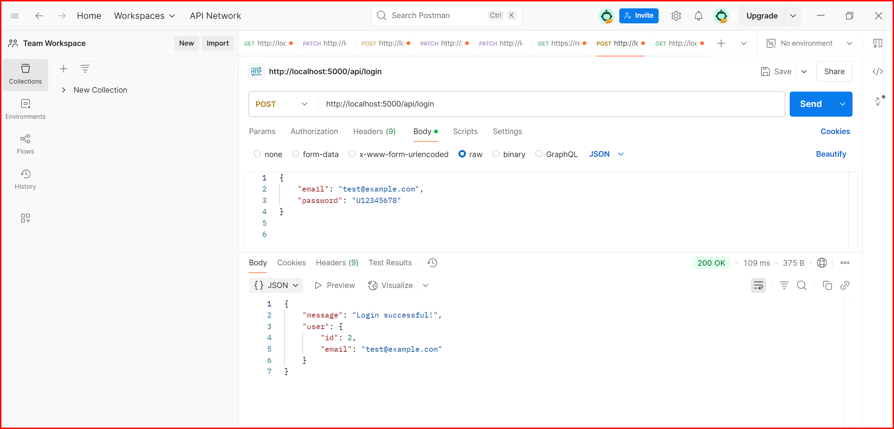

# Amazing Books Application Backend

## Overview

This repository contains the backend code for the Amazing Books Application. It sets up an Express server and defines API endpoints for user registration, login, and information updates, among other functionalities.

## Features

- User registration
- User login
- Update user information
- Fetch books from an external API
- Serve application logo

## Technologies Used

- **Node.js**: JavaScript runtime for server-side programming
- **Express**: Web framework for building the server
- **MySQL**: Database for storing user information
- **Bcrypt**: Library for hashing passwords
- **Axios**: For making HTTP requests
- **dotenv**: For managing environment variables
- **CORS**: Middleware for enabling Cross-Origin Resource Sharing

## Installation

### Prerequisites

- [Node.js](https://nodejs.org/) installed on your machine
- MySQL database set up and running

### Setup

1. **Clone the repository**:

   ```bash
   git clone https://github.com/YOUR_USERNAME/YOUR_REPOSITORY.git
   cd YOUR_REPOSITORY

   ```

2. **Install dependencies:**:

   ```bash
   npm install

   ```

3. \***\*Create a .env file** in the root directory and add your environment variables:\*\*:

   ```env
   MYSQL_HOST=your_mysql_host
   MYSQL_USER=your_mysql_user
   MYSQL_PASSWORD=your_mysql_password
   MYSQL_DATABASE=your_mysql_database
   PORT=5000
   VITE_API_URL=your_external_api_url
   REACT_APP_LOGO_URL=your_logo_url
   ```

4. **Run the server**:

   ```env
   npm run dev
   ```

## API Endpoints

### User Registration

- **Endpoint**: `POST /api/register`
- **Request Body**:

  ```json
  {
    "email": "user@example.com",
    "password": "yourpassword"
  }
  ```
**_Response_**:

``````html
- <span style="color: green;">Success: 201 Created</span> -
<span style="color: red;">Error: 400 Bad Request</span> or
<span style="color: red;">409 Conflict</span>

### User Login 
- **Endpoint**: `POST /api/login`
- **Request Body**: 
    ```json
 {
    "email": "user@example.com",
     "password": "yourpassword" 
     } 

### POSTMAN demo result



``````html
- <span style="color: green;">Success: 200 Created</span> -
<span style="color: red;">Error: 400 Bad Request</span> or
<span style="color: red;">401 Unauthorized</span>

    
### Update User Information
- **Endpoint**: `PATCH /api/users/:id`
- **Request Body**: ***(at least one field required):***
    ```json
 {
    "email": "user@example.com",
     "password": "newpassword" 
     } 

``````html
- <span style="color: green;">Success: 200 Created</span> -
<span style="color: red;">Error: 400 Bad Request</span> or

### Fetch Books
- **Endpoint**: `GET /api/books`
- **Response**:
  - **Success**: `200 OK` with book data
  - **Error**: `500 Internal Server Error`

### Fetch Logo
- **Endpoint**: `GET /api/logo`
- **Response**:
  - **Success**: `200 OK` with logo URL

## License
This project is licensed under the MIT License. See the LICENSE file for details.

### Explanation- The endpoint, request body, and response are clearly separated.- The JSON format is organized.Adding this format to the README will make it clearer. 

     
     
